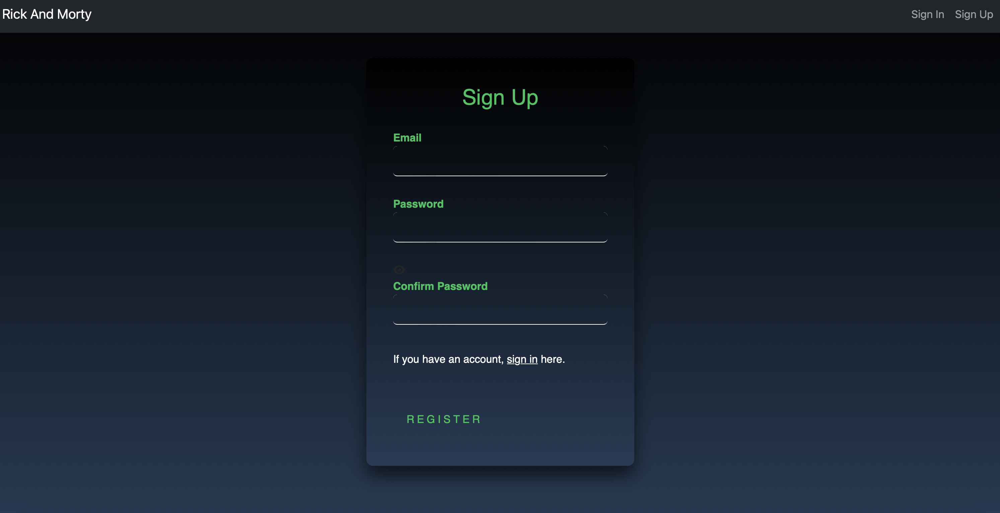
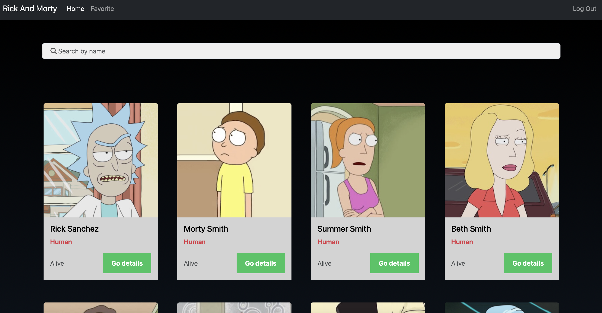
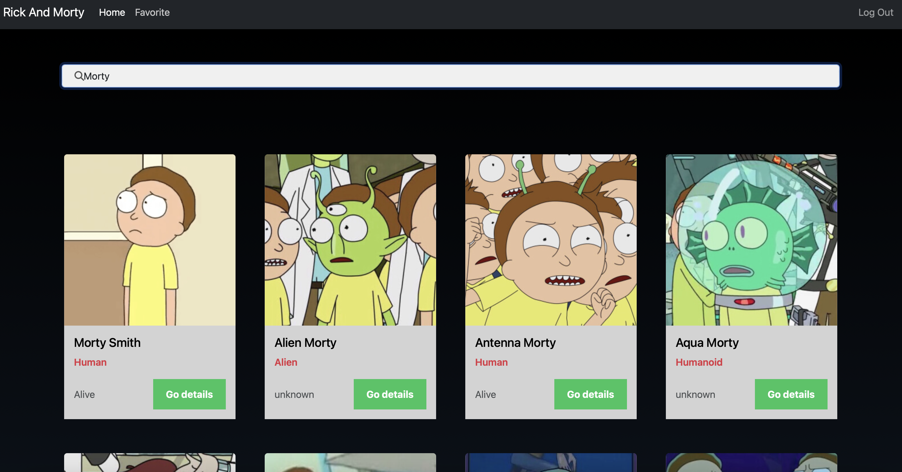
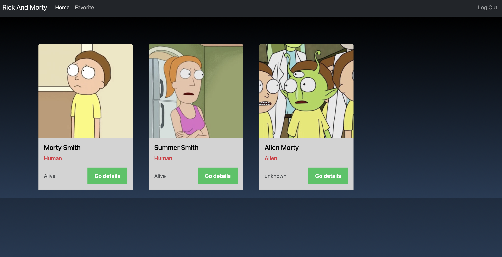

# RickAndMortyProject

This project was generated with [Angular CLI](https://github.com/angular/angular-cli) version 17.3.2.

## Getting Started


```bash
npm -i
```
After installing the package dependencies with:


```bash
ng serve
```

## Screenshots

### Register Screen

<div align="center">
  <br />
  
</div>

### Sign in Screen

<div align="center">
  <b>Sign in Screen</b>
  <br />
  
</div>

### Home Screen

<div align="center">
  <b>Home Screen</b>
  <br />
  
    

</div>


### Favorite Screen

<div align="center">
  <b> Favorite Screen</b>
  <br />
  
</div>
